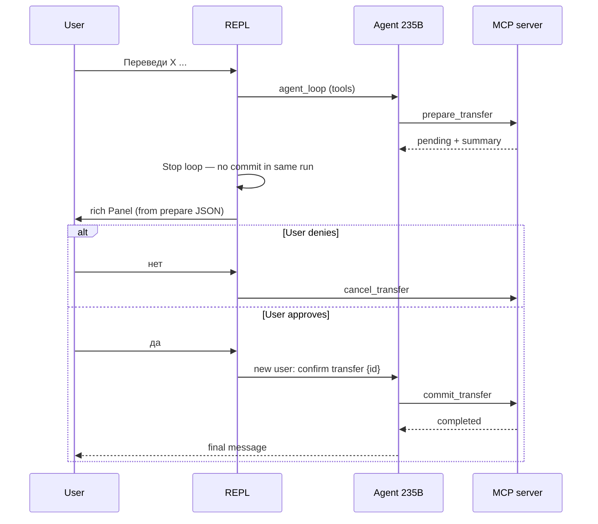

# Architecture — agentic-banking-mcp-demo

Demo for the AI-Native architecture course: evolution from a simple LLM chat to an autonomous banking agent with **Semantic Router**, **ReAct + function calling**, **MCP (stdio)**, and **Human-in-the-Loop (HITL)**.

## Runtime overview

```mermaid
flowchart LR
    subgraph CLI["REPL (rich)"]
        MEM[Session memory\nmessages[]]
        RTR[Semantic Router\nqwen3.5-35b]
        AGT[Agent loop\nqwen3-235b]
        HITL[HITL gate]
    end
    subgraph MCP["MCP banking server (stdio)"]
        T1[find_client]
        T2[get_account_balance]
        T3[prepare_transfer]
        T4[commit_transfer]
        T5[cancel_transfer]
        R1[banking://services]
    end
  DB[(SQLite\ndata/banking.db)]
  SVC[data/bank_services.md]

    User --> CLI
    RTR -->|simple| LLM1[Yandex OpenAI API]
    RTR -->|agent| AGT
    RTR -->|bank services| AGT
    AGT --> LLM2[Yandex OpenAI API]
    AGT --> MCP
    CLI -->|resources/read| MCP
    HITL --> MCP
    MCP --> OPS[operations/banking.py]
    OPS --> DB
    R1 --> SVC
```

## Repository paths (plan 02)

- **Repository root:** directory with `pyproject.toml` / `main.py` (not `src/`, not `data/`).
- **Resolution:** `DATABASE_PATH` and files under `data/` are normalized to absolute paths as `repo_root / <relative>` before SQLite or MCP env.
- **MCP subprocess:** `cwd=repo_root`, `PYTHONPATH=repo_root/src`, `DATABASE_PATH` absolute — so `data/banking.db` is the same file the REPL checks, regardless of shell cwd.

## Layers (onion)

| Layer | Path | Responsibility |
|-------|------|----------------|
| Domain | `src/core/` | Models, enums, `AppError` types |
| Application | `src/operations/` | Banking use cases, no HTTP/MCP/LLM imports |
| Infrastructure | `src/adapters/` | Config, OpenAI client, router, agent loop, MCP client, tool schema conversion, memory |
| MCP interface | `src/mcp_servers/` | FastMCP tool declarations → delegate to `operations/` |
| Delivery | `src/cli/`, `main.py` | REPL, routing, HITL, rich output |

**Concurrency:** Synchronous CLI and blocking OpenAI HTTP calls are intentional (see project rules). Do not block an asyncio event loop inside this app — there is no ASGI server in v1.

**State:** Demo exception — one in-memory `messages[]` per REPL session plus persistent SQLite. Not a stateless microservice.

## External systems

| System | Usage |
|--------|--------|
| [Yandex AI Studio](https://aistudio.yandex.ru/docs/en/ai-studio/concepts/generation/models.html) | `MODEL_ROUTER`, `MODEL_AGENT` via OpenAI-compatible endpoint |
| MCP stdio | Separate process; orchestrator never imports banking SQL directly |
| SQLite | `data/banking.db`, `sqlite3`, amounts in `amount_cents` (RUB) |

Environment (see `.env.example` when added):

```ini
YC_FOLDER_ID=
YC_API_KEY=
MODEL_ROUTER=qwen3.5-35b-a3b-fp8
MODEL_AGENT=qwen3-235b-a22b-fp8
DATABASE_PATH=data/banking.db
MCP_SERVER_MODULE=mcp_servers.banking_server
```

## Semantic router

1. Append user message to shared `messages[]`.
2. Call **router model** with a Russian system prompt: output JSON only, field `route` ∈ `simple` | `agent`. Request body: **one** `system` (router) + `user`/`assistant` dialog from memory — **not** agent `system` or `tool` rows (Yandex requires a single system block at the start).
3. **`simple`:** one completion on router model, **no** `tools`, **no** bank service catalog. Generic chitchat only; must not invent balances, transfers, or **this bank’s** product list. Final reply may be **streamed** to the terminal (plan 04).
4. **`agent`:** run **agent loop** on heavy model with `tools` built from MCP `list_tools`, and/or MCP **resource** read when answering about bank services (plan 02). Tool rounds stay blocking (Action/Observation); **final text-only** step may be streamed (plan 04).
5. **Default on parse error:** `agent`.
6. **Always `agent`:** balance queries, client lookup, transfers, any fact from DB, **questions about this demo bank’s services/products**.

## Agent loop (ReAct via function calling)

- Pattern aligned with `yandex-gpt-api/examples/tools_demo.py`: `chat.completions.create(..., tools=..., tool_choice="auto")`, append assistant + `role: tool` messages, repeat.
- **Max 8** tool rounds per invocation.
- **Observability (terminal):** rich **Action** (tool name + args), **Observation** (truncated tool result), **Resource** (URI). No synthetic Thought lines.
- **Observability (file, plan 03):** per-session log under `logs/repl-{timestamp}.log` (gitignored) — route, MCP calls, agent steps; on LLM failure full Yandex `status_code` + response body (secrets redacted). Level via `LOG_LEVEL` (default `INFO`).
- **No** LangGraph, **no** XML `<tool_call>` parsing.
- **LLM failures (UX):** short user-facing message in terminal; details in log file; no retry policy.
- **Streaming (plan 04):** `STREAM_FINAL_RESPONSE` (default on) — `stream=True` only for user-visible assistant prose (`simple` + agent step without `tool_calls`). Router and tool calls unchanged.

### Agent system rules (heavy model)

- Use tools for all factual banking data.
- Transfer flow: locate accounts → `prepare_transfer` → wait for human confirmation → only then `commit_transfer`.
- Never call `commit_transfer` in the same agent invocation that called `prepare_transfer`.

## HITL flow (transfers)



## MCP tools

| Tool | Effect |
|------|--------|
| `find_client` | Search by name/phone |
| `get_account_balance` | `balance_cents` (canonical) + `balance_rubles` / `balance_kopecks` for display |
| `prepare_transfer` | Insert `pending` transfer, validate funds |
| `commit_transfer` | Move funds, status `completed` |
| `cancel_transfer` | Status `cancelled` for `pending` |

Tool JSON schemas for the LLM are **only** produced from MCP `list_tools` (converted to OpenAI `tools` format).

## MCP resources (plan 02)

| URI | Source | Usage |
|-----|--------|--------|
| `banking://services` | `data/bank_services.md` | Catalog of demo bank products/services (Russian) |

Flow for “Какие услуги у банка?”:

1. Router → `agent` (not `simple`).
2. REPL calls MCP `resources/read` for `banking://services`.
3. Content injected into session context; heavy model answers from that text (rich may show **Resource** line).

**Rejected for services:** `simple` path without MCP (generic LLM essay about “any bank”).

## Data model (SQLite)

- **`clients`** — `id`, `full_name`, `phone`
- **`accounts`** — `id`, `client_id`, `currency` (`RUB`), `balance_cents`
- **`transfers`** — `id`, `from_account_id`, `to_account_id`, `amount_cents`, `status` (`pending` | `completed` | `cancelled`), `created_at`

Seed personas: **Иванов**, **Петров**, **Сидоров** (see `scripts/seed_db.py` in plan).

## Static data files (`data/`)

| File | Role |
|------|------|
| `data/banking.db` | SQLite (gitignored; created by `scripts/seed_db.py`) |
| `data/bank_services.md` | Demo bank services catalog (plan 02; versioned in git) |

## Observability (plan 03)

| Channel | Audience | Content |
|---------|----------|---------|
| Rich console | Lecture / operator | Action, Observation, Resource, `route=`, assistant reply (streamed when plan 04), HITL panel |
| `logs/repl-*.log` | Debugging / RCA | Session start, each user turn, router/agent/MCP events, Yandex API errors with body |

Setup: `setup_logging()` at REPL start; `LOG_LEVEL` from env. Do not commit `logs/`. MCP subprocess stderr (FastMCP INFO) may still appear in the terminal; orchestrator MCP client events go to the file.

## Testing strategy

- **Unit:** `tests/operations/` — domain rules without LLM or MCP.
- **Integration:** `tests/integration/` — MCP tools + resources (plan 02), temp DB with absolute path.
- **Manual:** lecture smoke in active plan `docs/plans/02-db-paths-and-bank-services.md` (supersedes plan 01 item for services).

## Related docs

- Decisions log: `docs/DECISIONS.md`
- Active plan: `docs/plans/04-streaming-final-response.md`
- Plan 03 (archived): `docs/plans/03-file-logging.md`
- Plan 02 (archived): `docs/plans/02-db-paths-and-bank-services.md`
- Plan 01 (archived): `docs/plans/01-banking-agent-mcp-demo.md`
- File map: `docs/INDEX.md`
- Status: `docs/PROGRESS.md`
